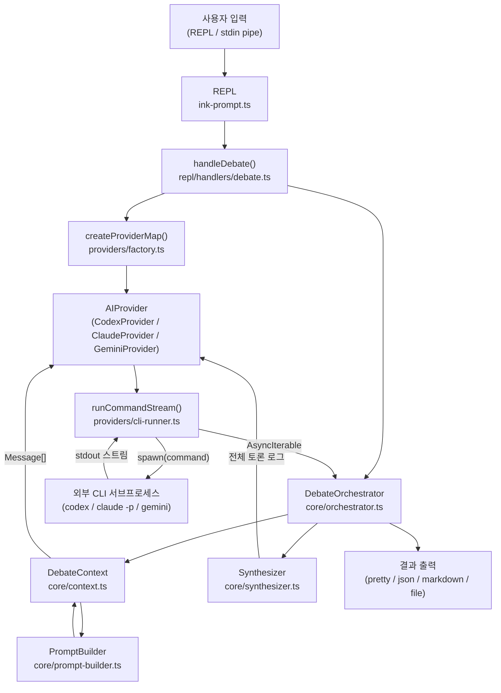
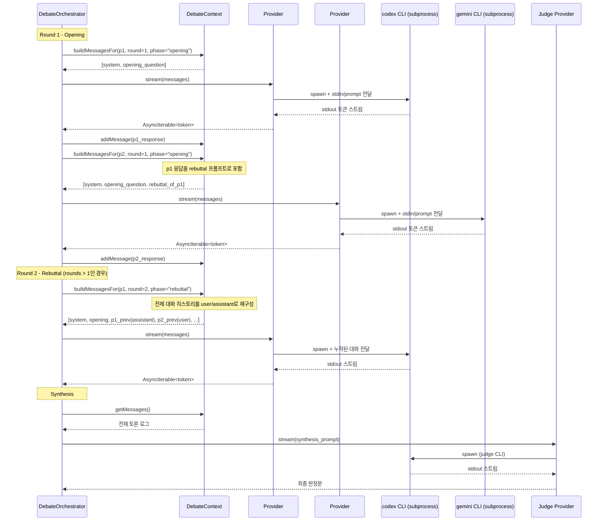
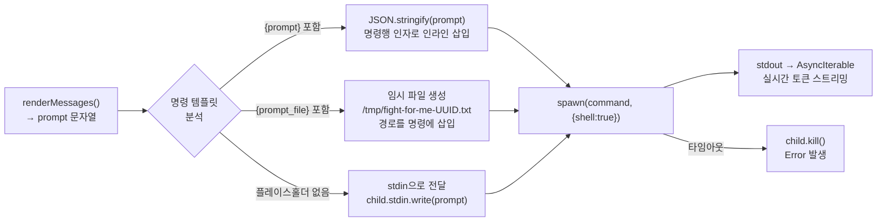

# fight-for-me 아키텍처: CLI 명령 전달 구조

## 개요

`ffm`은 Codex, Claude, Gemini CLI를 **서브프로세스**로 실행하여 구조화된 토론을 진행합니다.
각 AI는 독립된 외부 CLI 프로세스로 실행되며, ffm이 프롬프트를 조립하여 stdin 또는 명령행 인자로 전달하고 stdout을 실시간으로 스트리밍합니다.

---

## 전체 흐름 다이어그램



---

## 라운드별 턴 실행 흐름



---

## 프롬프트 전달 방식 상세

### 1. 메시지 배열 조립 (`DebateContext.buildMessagesFor`)

각 턴마다 `DebateContext`가 해당 AI에게 전달할 `Message[]` 배열을 조립합니다.

```
Message[] 구조:
┌─────────────────────────────────────────────────────────┐
│ { role: "system",    content: [시스템 프롬프트]          }│
│ { role: "user",      content: [오프닝 질문]              }│
│ { role: "user",      content: [상대방 답변 리버틀 래핑] }│  ← Round 1 2번째 참가자
│ { role: "assistant", content: [내 이전 답변]             }│  ← Rebuttal 라운드
│ { role: "user",      content: [상대방 최신 답변 래핑]    }│  ← Rebuttal 라운드
└─────────────────────────────────────────────────────────┘
```

**Round 1 - 첫 번째 참가자 (opening):**
```
[system] You are Codex, participating in a structured debate with Gemini...
[user]   A user has asked: "질문" → Please provide your initial answer.
```

**Round 1 - 두 번째 참가자 (opening + implicit rebuttal):**
```
[system] You are Gemini, participating in a structured debate with Codex...
[user]   A user has asked: "질문" → Please provide your initial answer.
[user]   Codex has responded: ---[codex 답변]--- Please respond by...
```

**Round 2+ (rebuttal):**
```
[system] You are Codex...
[user]   A user has asked: "질문"
[assistant] [Round 1에서 내가 했던 답변]
[user]   Gemini has responded: ---[gemini 답변]--- Please respond by...
```

---

### 2. 텍스트 직렬화 (`cli-runner.ts: renderMessages`)

`Message[]`를 단일 평문 문자열로 변환합니다. 외부 CLI가 OpenAI API 형식을 직접 받지 않기 때문입니다.

```
변환 규칙:
  role="system"    → 그대로 출력 (구분자 "---" 추가)
  role="user"      → 그대로 출력
  role="assistant" → "[Your previous response]\n" 접두사 추가
```

**예시 결과 텍스트:**
```
You are Codex, participating in a structured debate with Gemini.

Rules:
1. Present clear, well-reasoned arguments...
...

---

A user has asked the following question for debate:

"TypeScript vs JavaScript?"

Please provide your initial answer.
```

---

### 3. CLI 서브프로세스 실행 (`cli-runner.ts: runCommandStream`)



| 전달 방식 | 사용 시나리오 | 예시 명령 설정 |
|-----------|--------------|----------------|
| **stdin** | 기본값 (플레이스홀더 없음) | `codex -p`, `claude -p` |
| **`{prompt}` 인라인** | 명령행 인자로 직접 전달 | `my-cli --message {prompt}` |
| **`{prompt_file}` 파일** | 긴 프롬프트 or 파일 경로 기반 CLI | `my-cli --file {prompt_file}` |

---

### 4. Synthesis (판정) 프롬프트

토론 종료 후 Judge 역할의 AI가 전체 로그를 받아 최종 판정을 수행합니다.

```
[system] You are a fair and balanced judge reviewing a debate between Codex and Gemini.

Original Question: "..."

Full Debate Transcript:

[Round 1 - Codex]
...codex 답변...

---

[Round 1 - Gemini]
...gemini 답변...

---

Please provide a comprehensive synthesis:
1. Summarize key points of agreement...
2. Highlight most compelling arguments...
3. Identify where one side had stronger reasoning...
4. Provide a final, balanced answer...
```

---

## 주요 파일 맵

```
src/
├── bin/cli.ts                      # CLI 진입점
├── repl/
│   ├── ink-prompt.ts               # TTY/stdin 입력 처리
│   ├── registry.ts                 # 명령 핸들러 라우팅
│   ├── session.ts                  # 세션 상태 (rounds, format, participants, output 등)
│   └── handlers/
│       ├── debate.ts               # 토론 시작, 파일 저장
│       └── session-settings.ts     # /rounds, /format, /participants, /output 등
├── core/
│   ├── orchestrator.ts             # 라운드 루프, 턴 실행, synthesis 조율
│   ├── context.ts                  # 메시지 히스토리 관리, Message[] 조립
│   ├── prompt-builder.ts           # 시스템/오프닝/리버틀/synthesis 프롬프트 생성
│   └── synthesizer.ts             # Judge 실행
├── providers/
│   ├── cli-runner.ts               # 서브프로세스 spawn, stdin/file/inline 전달, 스트리밍
│   ├── codex.ts                    # CodexProvider (cli-runner 위임)
│   ├── claude.ts                   # ClaudeProvider (cli-runner 위임)
│   ├── gemini.ts                   # GeminiProvider (cli-runner 위임)
│   └── factory.ts                  # 필요한 provider만 선택 인스턴스화
└── ui/
    ├── renderer.ts                 # pretty/json/markdown 출력, 파일용 buildMarkdownContent
    └── streamer.ts                 # stdout 토큰 스트리밍 출력
```

---

## 환경 격리

각 AI CLI 서브프로세스는 다음 조건으로 격리 실행됩니다:

```typescript
spawn(command, {
  shell: true,
  stdio: 'pipe',        // stdin/stdout/stderr 모두 파이프
  env: {
    ...process.env,
    CLAUDECODE: '',     // Claude가 Claude Code 내부 실행임을 감지하지 못하도록 초기화
  },
})
```

- `CLAUDECODE=''` 설정으로 Claude subprocess가 상위 Claude Code 컨텍스트를 상속하지 않음
- 각 턴마다 **새로운 프로세스**를 spawn — 상태 공유 없음, 완전 독립 실행
- 타임아웃 초과 시 `child.kill()`로 강제 종료
