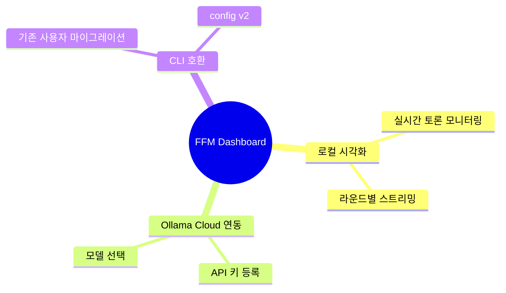
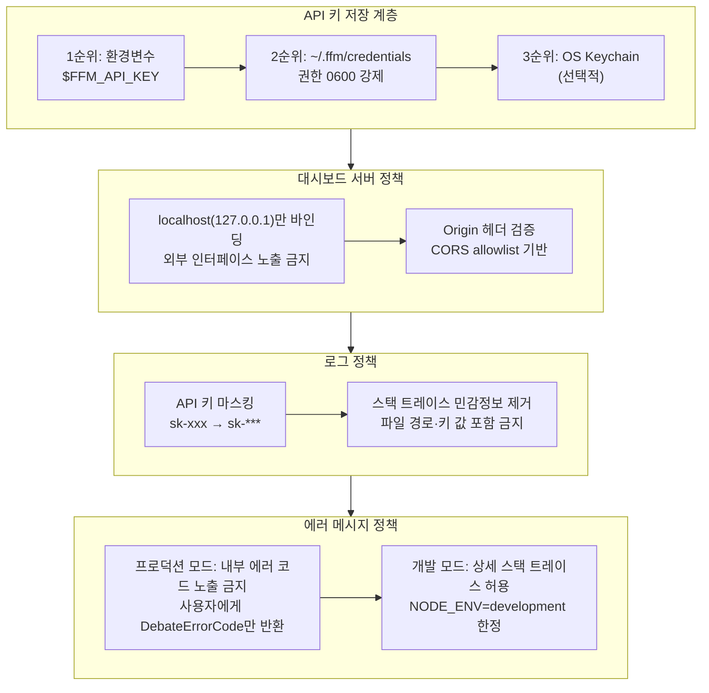
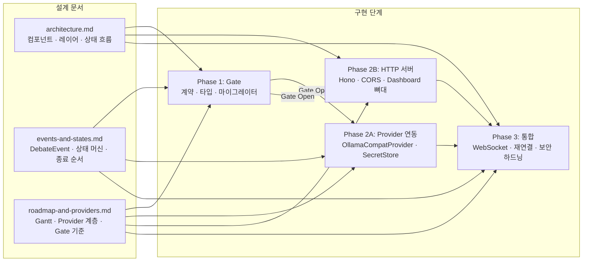

# fight-for-me 대시보드 개발 설계 문서

> 이 문서 모음은 `docs/dashboard2.md`의 AI 토론 결과(Final Synthesis)를 기반으로 작성된
> fight-for-me(ffm) 대시보드 기능 추가 및 Ollama Cloud 연동을 위한 목표 아키텍처 정의입니다.

---

## 목차

| 문서 | 내용 |
|------|------|
| [architecture.md](./architecture.md) | 컴포넌트 다이어그램, 레이어드 아키텍처, CLI ↔ Dashboard 상태 공유 흐름 |
| [events-and-states.md](./events-and-states.md) | DebateEvent 시퀀스, 상태 머신, 프로세스 종료 순서, TypeScript 타입 정의 |
| [roadmap-and-providers.md](./roadmap-and-providers.md) | Gantt 개발 로드맵, Provider 클래스 계층도, 모델 등록 UX, Gate 완료 기준 |

---

## 배경 및 목표



fight-for-me는 복수의 AI 에이전트가 주제를 놓고 토론하는 CLI 도구입니다.
이번 개발 목표는 세 가지입니다:

1. **로컬 시각화**: 브라우저 기반 대시보드에서 토론을 실시간으로 모니터링
2. **Ollama Cloud 연동**: HTTP 기반 Provider 계층을 추가해 Ollama Cloud 및 OpenAI-compat API 지원
3. **CLI 완전 호환**: config v2 마이그레이터로 기존 사용자 설정 자동 변환

---

## 핵심 설계 원칙

### 1. 헤드리스 코어 우선 (Headless-Core-First)

`DebateEngine`은 UI에 의존하지 않는 독립 실행 단위입니다.
CLI, 대시보드, 테스트 모두 동일한 엔진을 사용하며, UI 레이어 교체 시 엔진 코드 변경은 없습니다.

### 2. 게이트 기반 병렬 개발 (Gate-Based Parallelism)

Phase 1 Gate(계약 테스트, 타입 정의, 마이그레이터)를 모두 통과한 후에만
Track A(Provider 연동)와 Track B(HTTP 서버 + 대시보드)를 병렬로 시작합니다.
인터페이스 계약이 먼저 확정되어야 병렬 작업이 안전하게 진행됩니다.

### 3. 보안 내장 (Security-by-Default)

API 키 평문 저장 금지, localhost-only 바인딩, 로그 redaction은 선택 기능이 아니라
기본 동작입니다. 보안 정책은 아래 섹션에서 자세히 정의합니다.

---

## 보안 정책



---

## Config v2 스키마

기존 `~/.ffm/config.json`(v1)은 시작 시 자동으로 v2로 마이그레이션됩니다.
**apiKey는 스키마에 포함하지 않습니다** — 환경변수 참조(`apiKeyEnvVar`) 또는 OS Keychain을 사용합니다.

```typescript
interface ConfigV2 {
  version: 2
  providers: Record<string, ProviderConfig>
  defaultProvider?: string
  debate: DebateConfig
  dashboard?: DashboardConfig
}

interface ProviderConfig {
  type: 'ollama-compat' | 'anthropic' | 'cli'
  baseUrl?: string
  // apiKey는 환경변수 참조 또는 keychain - 평문 저장 금지
  apiKeyEnvVar?: string
  model: string
  capabilities: ProviderCapabilities
}

interface DashboardConfig {
  port: number           // default: 3847
  host: string           // default: '127.0.0.1' (localhost only)
  corsOrigin: string[]   // default: ['http://localhost:3847']
}
```

---

## SessionStore 인터페이스

`SessionStore`는 토론 세션의 전체 이벤트 로그를 보관하는 핵심 저장소입니다.
기본 구현은 in-memory Map을 사용하며, Phase 3에서 SQLite로 선택적 전환이 가능합니다.

```typescript
interface SessionStore {
  create(sessionId: string, metadata: SessionMetadata): void
  append(sessionId: string, event: DebateEvent): void
  get(sessionId: string): DebateSession | undefined
  list(): SessionSummary[]
  delete(sessionId: string): void
}
```

**In-memory 구현 방식**: `Map<string, DebateSession>`에 세션을 저장하고,
각 세션은 `DebateEvent[]` 배열을 append-only로 누적합니다.
대시보드 재연결 시 `get(sessionId).events`를 전송해 상태를 복원합니다.

---

## 문서 간 관계 다이어그램



---

*이 문서 모음은 `docs/dashboard2.md` Final Synthesis를 기반으로 작성되었습니다.*