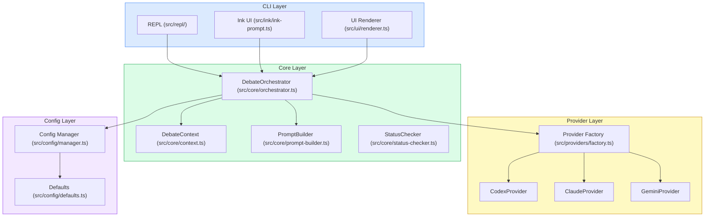
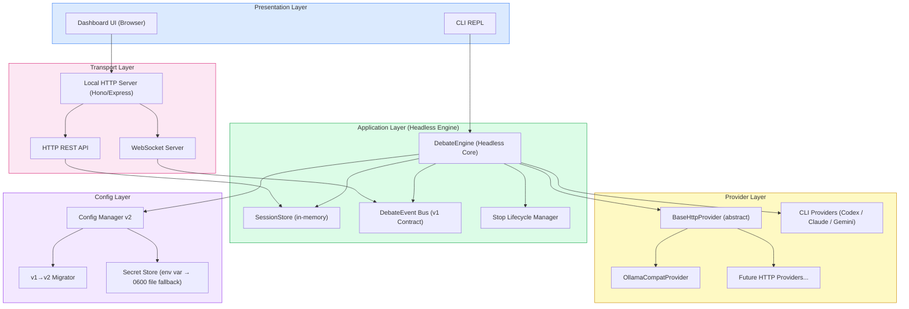
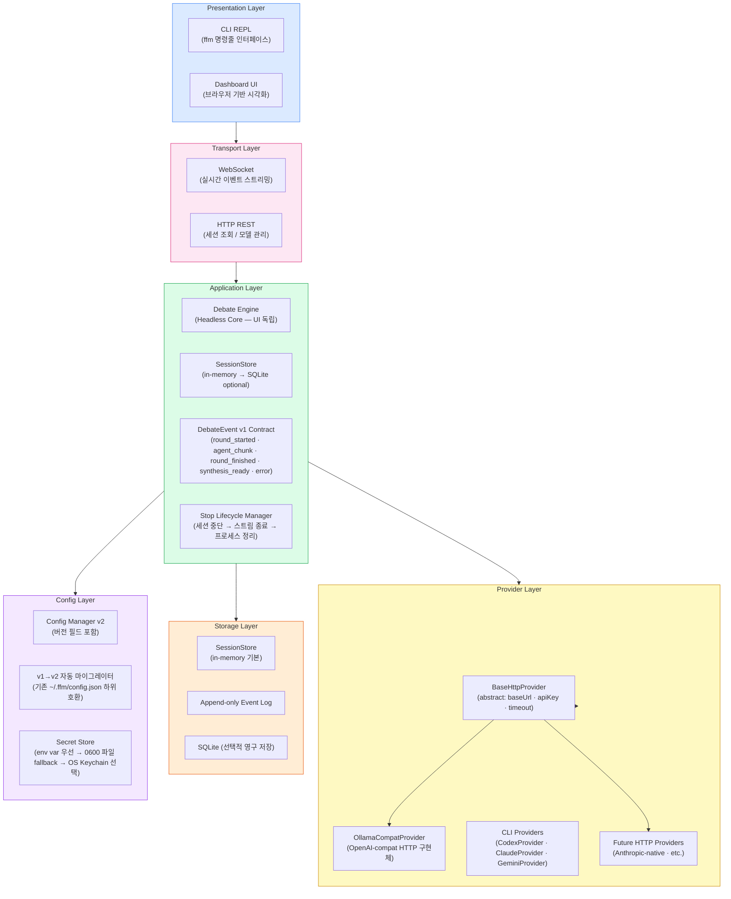
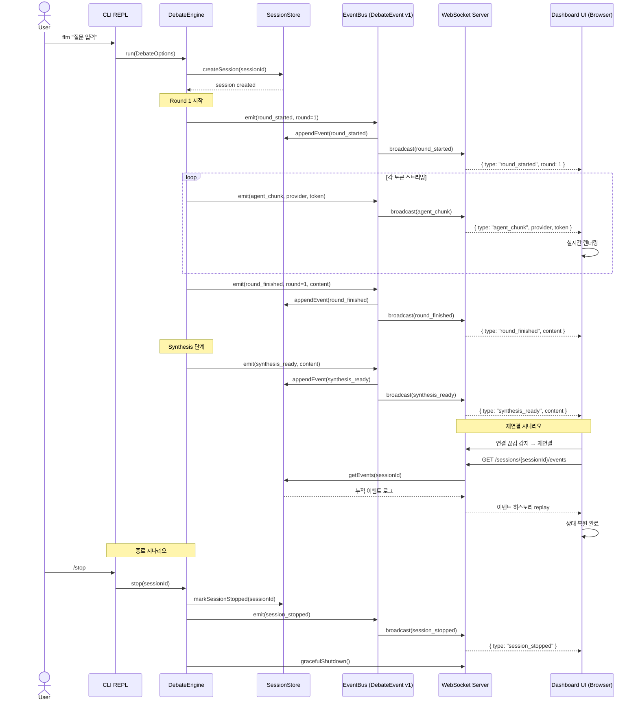

# fight-for-me 시스템 아키텍처 설계

> 대시보드 기능 추가 및 Ollama Cloud 연동을 위한 목표 아키텍처 정의

---

## 1. 전체 컴포넌트 다이어그램

현재 구조와 목표 구조 간의 전환을 보여주는 컴포넌트 맵.

### 현재 구조 (AS-IS)

### 목표 구조 (TO-BE)

---

## 2. 레이어드 아키텍처 다이어그램

각 레이어의 책임과 의존 방향을 명확히 정의한다.

---

## 3. CLI ↔ Dashboard 상태 공유 흐름

CLI에서 시작한 토론 세션을 Dashboard가 실시간으로 수신하는 시퀀스.

---

## 4. 컴포넌트 책임 요약

| 컴포넌트 | 위치 (목표) | 책임 |
|---|---|---|
| `DebateEngine` | `src/core/engine.ts` | UI 독립 토론 실행, 이벤트 발행 |
| `SessionStore` | `src/core/session-store.ts` | 세션 ID 기반 상태 저장, 이벤트 로그 |
| `EventBus` | `src/core/event-bus.ts` | DebateEvent v1 타입 계약, 구독자 관리 |
| `StopLifecycleManager` | `src/core/stop-lifecycle.ts` | 세션 중단 → 스트림 종료 → 프로세스 정리 순서 보장 |
| `BaseHttpProvider` | `src/providers/http-base.ts` | HTTP 기반 Provider 공통 추상 베이스 |
| `OllamaCompatProvider` | `src/providers/ollama-compat.ts` | OpenAI-compat API (Ollama Cloud) 구현체 |
| `LocalHttpServer` | `src/server/index.ts` | REST + WebSocket 서버 (localhost 바인딩) |
| `Config Manager v2` | `src/config/manager.ts` | v2 스키마 + v1 자동 마이그레이션 |
| `SecretStore` | `src/config/secret-store.ts` | API 키 보안 저장 (env → 파일 → OS keychain) |
| `Dashboard UI` | `dashboard/` | 브라우저 기반 실시간 토론 시각화 |

---

## 5. 보안 고려사항

- **로컬 바인딩**: HTTP 서버는 `127.0.0.1`에만 바인딩 (외부 노출 차단)
- **CORS/Origin 제한**: Dashboard 전용 Origin만 허용
- **로그 Redaction**: API 키, 에러 스택 트레이스에서 민감 정보 마스킹
- **에러 메시지 마스킹**: 외부로 노출되는 에러에 API 키 포함 금지
- **Secret Store 우선순위**: `$ENV_VAR` → `~/.ffm/credentials` (0600) → OS Keychain

---

*이 문서는 `docs/dashboard2.md` Final Synthesis를 기반으로 작성되었습니다.*