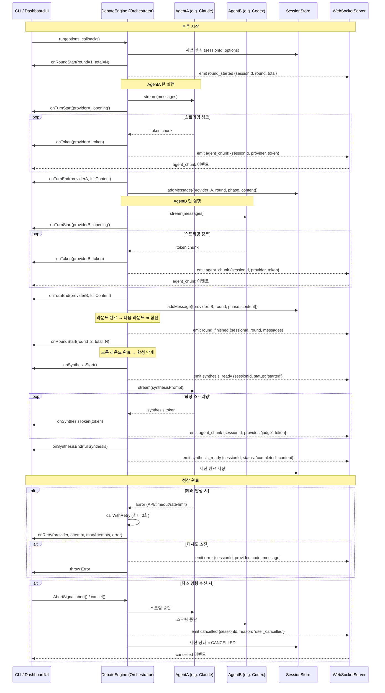
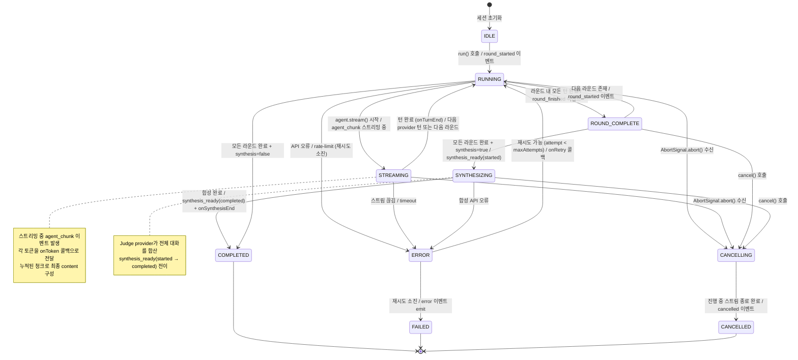
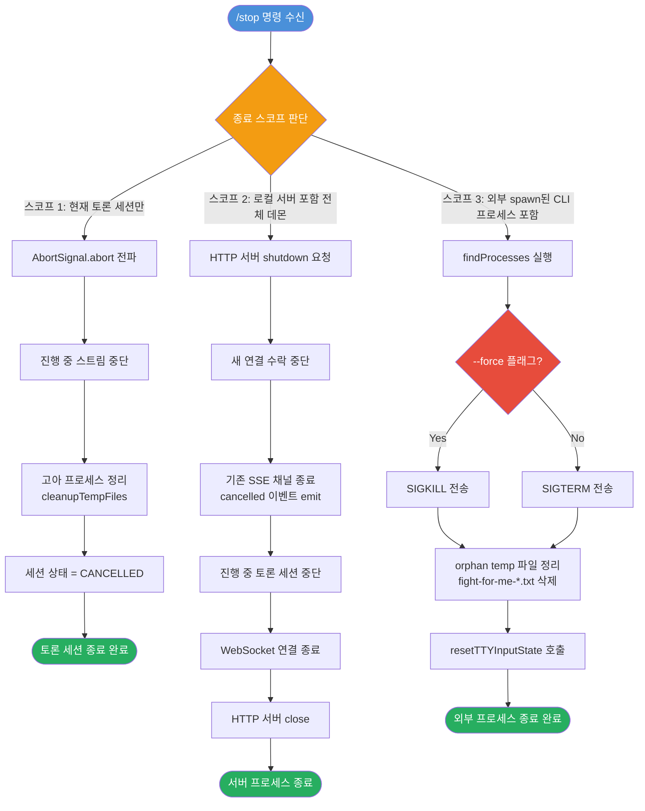

# 이벤트 흐름 & 상태 머신 설계

fight-for-me 토론 세션의 이벤트 계약, 상태 전이, 프로세스 종료 순서를 정의합니다.

---

## 1. DebateEvent 시퀀스 다이어그램

토론 세션에서 발생하는 이벤트의 전체 흐름을 나타냅니다.
현재 구현은 CLI 기반이며, 웹 대시보드 확장 시 `WebSocketServer`와 `DashboardUI` 컴포넌트가 추가됩니다.



---

## 2. 토론 세션 상태 머신

토론 세션 생명주기의 모든 상태와 전이를 정의합니다.



---

## 3. 프로세스 종료 순서 다이어그램

`/stop` 명령 수신 시 스코프에 따른 종료 처리 흐름을 나타냅니다.



---

## 4. DebateEvent v1 타입 정의

웹 대시보드 확장 시 WebSocket/SSE로 전송되는 이벤트 계약입니다.

```typescript
// DebateEvent v1 - 이벤트 타입 열거형
type DebateEventType =
  | 'round_started'    // 새 라운드 시작
  | 'agent_chunk'      // AI 에이전트 토큰 스트리밍 청크
  | 'round_finished'   // 라운드 완료
  | 'synthesis_ready'  // 합성(판정) 시작 또는 완료
  | 'cancelled'        // 세션 취소
  | 'error'            // 에러 발생

// 공통 이벤트 베이스
interface DebateEventBase {
  type: DebateEventType
  sessionId: string
  timestamp: number   // Unix ms
}

// round_started: 새 라운드가 시작될 때 발생
interface RoundStartedEvent extends DebateEventBase {
  type: 'round_started'
  payload: {
    round: number       // 현재 라운드 번호 (1-based)
    total: number       // 전체 라운드 수
    participants: [string, string]  // e.g. ['claude', 'codex']
  }
}

// agent_chunk: AI 에이전트가 토큰을 스트리밍할 때마다 발생
interface AgentChunkEvent extends DebateEventBase {
  type: 'agent_chunk'
  payload: {
    provider: string    // 'claude' | 'codex' | 'gemini' | 'judge'
    token: string       // 스트리밍 토큰 (누적 필요)
    round: number
    phase: 'opening' | 'rebuttal' | 'synthesis'
  }
}

// round_finished: 라운드 내 모든 참가자의 턴이 완료되었을 때 발생
interface RoundFinishedEvent extends DebateEventBase {
  type: 'round_finished'
  payload: {
    round: number
    messages: Array<{
      provider: string
      phase: 'opening' | 'rebuttal'
      content: string   // 전체 응답 텍스트
    }>
  }
}

// synthesis_ready: 합성(판정) 단계의 시작 또는 완료
interface SynthesisReadyEvent extends DebateEventBase {
  type: 'synthesis_ready'
  payload: {
    status: 'started' | 'completed'
    judge: string       // 판정 담당 provider
    content?: string    // status='completed' 시에만 포함
  }
}

// cancelled: 사용자 요청 또는 시스템에 의해 세션이 취소됨
interface CancelledEvent extends DebateEventBase {
  type: 'cancelled'
  payload: {
    reason: 'user_cancelled' | 'timeout' | 'server_shutdown'
    lastRound?: number  // 취소 시점의 마지막 완료 라운드
    lastProvider?: string  // 취소 시점에 응답 중이던 provider
  }
}

// error: 에러 발생 (재시도 소진 또는 복구 불가 오류)
interface ErrorEvent extends DebateEventBase {
  type: 'error'
  payload: {
    code: DebateErrorCode
    message: string
    provider?: string   // 에러를 발생시킨 provider (있는 경우)
    round?: number      // 에러 발생 라운드
    retryable: boolean  // 클라이언트 재시도 가능 여부
  }
}

// 에러 코드 분류 (에러 taxonomy)
type DebateErrorCode =
  | 'RATE_LIMIT_EXCEEDED'    // API rate limit (재시도 가능)
  | 'PROVIDER_TIMEOUT'       // AI 응답 타임아웃
  | 'PROVIDER_UNAVAILABLE'   // CLI/API 연결 불가
  | 'STREAM_INTERRUPTED'     // 스트림 중간 끊김
  | 'CONTEXT_TOO_LONG'       // 컨텍스트 길이 초과
  | 'AUTH_FAILED'            // 인증 실패
  | 'INTERNAL_ERROR'         // 내부 오케스트레이터 오류

// 유니온 타입 - 모든 이벤트
type DebateEvent =
  | RoundStartedEvent
  | AgentChunkEvent
  | RoundFinishedEvent
  | SynthesisReadyEvent
  | CancelledEvent
  | ErrorEvent

// 웹 대시보드 SSE/WebSocket 전송 형식
interface DebateEventEnvelope {
  event: DebateEvent
  sequence: number  // 세션 내 이벤트 순번 (재연결 시 resume 포인트)
}
```

---

## 5. 이벤트 흐름 요약 (정상 경로)

| 순서 | 이벤트 | 발신자 | 수신자 | 설명 |
|------|--------|--------|--------|------|
| 1 | `round_started` | DebateEngine | 모든 구독자 | 새 라운드 시작 알림 |
| 2 | `agent_chunk` (반복) | DebateEngine | 모든 구독자 | AgentA 토큰 스트리밍 |
| 3 | `agent_chunk` (반복) | DebateEngine | 모든 구독자 | AgentB 토큰 스트리밍 |
| 4 | `round_finished` | DebateEngine | 모든 구독자 | 라운드 완료 및 전체 메시지 |
| 5 | (2-4 반복) | — | — | 추가 라운드 반복 |
| 6 | `synthesis_ready(started)` | DebateEngine | 모든 구독자 | 합성 단계 시작 |
| 7 | `agent_chunk` (반복) | DebateEngine | 모든 구독자 | 합성 토큰 스트리밍 |
| 8 | `synthesis_ready(completed)` | DebateEngine | 모든 구독자 | 합성 완료 및 최종 내용 |

## 6. 취소 전파 규칙

```
취소 명령 수신
    ↓
AbortSignal.abort() 전파
    ↓
현재 실행 중인 provider 스트림 즉시 중단
    ↓
진행 중인 AsyncIterable for...await 루프 탈출
    ↓
cancelled 이벤트 emit (sessionId, reason, lastRound)
    ↓
orphan 프로세스 정리 (cleanupTempFiles)
    ↓
세션 상태 → CANCELLED
```

**취소 전파 스코프별 동작:**

| 스코프 | 대상 | 처리 방법 |
|--------|------|-----------|
| 세션만 | 현재 토론 세션 스트림 | `AbortSignal.abort()` |
| 데몬 전체 | HTTP 서버 + 모든 활성 세션 | `server.close()` + 모든 세션 취소 |
| CLI 프로세스 | 외부 spawn된 node 프로세스 | `SIGTERM` / `SIGKILL` |
