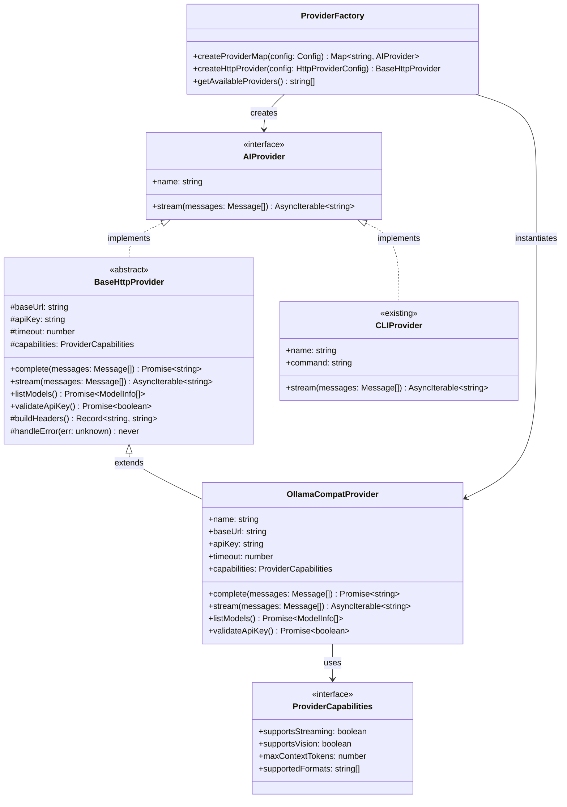
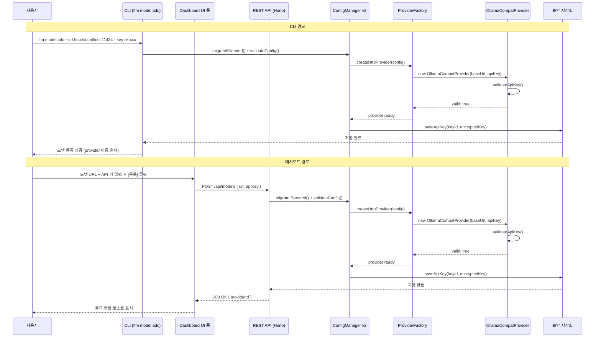

# FFM Dashboard 개발 로드맵 & Provider 계층 설계

## 개요

이 문서는 fight-for-me (ffm) 프로젝트의 대시보드 기능 추가를 위한 3단계 개발 로드맵과
Provider 클래스 계층 설계를 정의합니다.

---

## 1. 개발 로드맵 (Gantt 차트)

```mermaid
gantt
  dateFormat X
  axisFormat Day %d
  title FFM Dashboard 개발 로드맵

  section Gate (Phase 1)
  DebateEvent v1 의미 계약 + 계약 테스트     :gate1, 0, 1
  HttpProvider 추상 베이스 + OllamaCompatProvider 인터페이스 :gate2, 0, 1
  config v2 자동 마이그레이터 (v1 하위호환)  :gate3, 1, 2
  SessionStore 인터페이스 (in-memory 구현)   :gate4, 1, 2
  /stop 종료 순서 계약 문서화               :gate5, 2, 3

  section Parallel Track A (Phase 2)
  OllamaCompatProvider 실제 연동            :trackA1, 3, 5
  API 키 보안 저장소                        :trackA2, 3, 5
  Ollama Cloud 연동 테스트                  :trackA3, 5, 7

  section Parallel Track B (Phase 2)
  로컬 HTTP 서버 (Hono) 구현               :trackB1, 3, 5
  대시보드 뼈대 (CORS + redaction 포함)    :trackB2, 4, 7

  section Integration (Phase 3)
  WebSocket 이벤트 스트리밍 연결           :int1, 7, 9
  세션 재연결 처리                         :int2, 7, 9
  모델 등록 UX (CLI + 대시보드 통합)      :int3, 9, 11
  보안 하드닝                              :int4, 11, 12
  SQLite 마이그레이션 (선택)               :int5, 11, 12
```



---

## 2. Provider 클래스 계층도

현재 ffm은 외부 CLI 서브프로세스 기반 Provider를 사용합니다.
2단계에서 HTTP 기반 Provider 계층이 추가됩니다.



---

## 3. 모델 등록 UX 플로우

CLI와 대시보드 두 경로 모두 동일한 `ConfigManager v2` → `ProviderFactory` 경로를 공유합니다.



---

## 4. Gate 완료 기준 플로우차트

Phase 1 Gate를 통과해야 Phase 2 병렬 트랙을 시작할 수 있습니다.

```mermaid
flowchart TD
  Start([Phase 1 시작]) --> A

  A[계약 테스트 CI 실행]
  A -->|실패| A_fail[계약 테스트 수정]
  A_fail --> A
  A -->|통과| B

  B[DebateEvent round-trip 검증\n모든 이벤트 타입 직렬화 + 역직렬화]
  B -->|실패| B_fail[DebateEvent v1 스키마 수정]
  B_fail --> B
  B -->|통과| C

  C[/stop 종료 순서 문서화 완료\n스코프 명확히 정의]
  C -->|미완| C_fail[문서 작성]
  C_fail --> C
  C -->|완료| D

  D[config v2 마이그레이터 동작 확인\nv1 설정 파일 자동 변환 테스트]
  D -->|실패| D_fail[마이그레이터 버그 수정]
  D_fail --> D
  D -->|통과| E

  E[SessionStore in-memory 구현 검증\nCRUD + TTL 테스트]
  E -->|실패| E_fail[SessionStore 구현 수정]
  E_fail --> E
  E -->|통과| GateOpen

  GateOpen([Gate Open\nPhase 2 병렬 트랙 시작 가능])

  style GateOpen fill:#2d8a4e,color:#fff
  style Start fill:#1a6bbf,color:#fff
  style A_fail fill:#c0392b,color:#fff
  style B_fail fill:#c0392b,color:#fff
  style C_fail fill:#c0392b,color:#fff
  style D_fail fill:#c0392b,color:#fff
  style E_fail fill:#c0392b,color:#fff
```

---

## 5. 단계별 체크리스트

### Phase 1 - Gate (1~3일)

| 항목 | 담당 | 완료 기준 |
|------|------|-----------|
| DebateEvent v1 타입 스키마 확정 | 아키텍처팀 | TypeScript 타입 + JSON Schema 모두 정의 |
| DebateEvent 계약 테스트 작성 | 테스트팀 | CI에서 green |
| `BaseHttpProvider` 추상 클래스 | 구현팀 | 컴파일 오류 없음 + 인터페이스 문서화 |
| `OllamaCompatProvider` 인터페이스 | 구현팀 | stub 구현으로 타입 검증 통과 |
| `ConfigManager v2` 마이그레이터 | 구현팀 | v1 → v2 자동 변환 + 롤백 가능 |
| `SessionStore` 인터페이스 + in-memory | 구현팀 | 단위 테스트 통과 |
| `/stop` 종료 순서 문서화 | 팀 전체 | 스코프 문서 PR 머지 |

### Phase 2 - 병렬 트랙 (Gate 후)

**Track A: Provider 연동**

| 항목 | 완료 기준 |
|------|-----------|
| `OllamaCompatProvider` 실제 구현 | Ollama 로컬 + Cloud API 연동 테스트 통과 |
| API 키 보안 저장소 | OS 키체인 또는 암호화 파일 저장 + 복호화 테스트 |

**Track B: HTTP 서버 + 대시보드**

| 항목 | 완료 기준 |
|------|-----------|
| Hono 기반 로컬 HTTP 서버 | GET/POST 엔드포인트 동작 + CORS 설정 |
| 대시보드 뼈대 | 기본 레이아웃 렌더링 + API 키 redaction 동작 |

### Phase 3 - 통합 (7~12일)

| 항목 | 완료 기준 |
|------|-----------|
| WebSocket 이벤트 스트리밍 | 실시간 토론 이벤트 → 대시보드 전달 |
| 세션 재연결 | 연결 끊김 후 자동 재연결 + 상태 복원 |
| 모델 등록 UX 통합 | CLI와 대시보드 동일 경로 사용 확인 |
| 보안 하드닝 | 입력 검증, 인증 토큰, rate limiting |
| SQLite 마이그레이션 (선택) | in-memory SessionStore → 영속 저장소 |

---

## 6. 핵심 설계 원칙

- **단일 진입점**: CLI와 대시보드 모두 `ConfigManager v2` → `ProviderFactory` 경로를 사용합니다.
- **하위 호환**: config v2 마이그레이터가 v1 설정을 자동 변환하므로 기존 사용자 설정이 유지됩니다.
- **보안 우선**: API 키는 평문으로 저장하지 않으며, 로그 및 API 응답에서 redaction 처리합니다.
- **Gate 원칙**: Phase 2 작업은 Gate 기준을 모두 통과한 후에만 시작합니다.
- **병렬 독립성**: Track A와 Track B는 Gate 완료 후 독립적으로 진행 가능합니다.